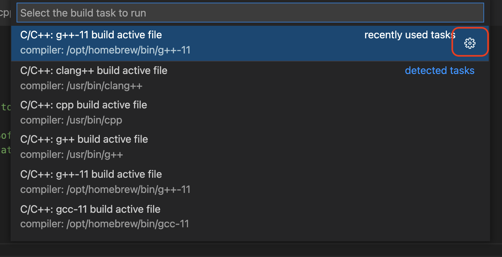

在 Clion 没有免费版本的情况下，Visual Studio Code 成为了 Linux/Mac 下最值得使用的编辑器(Windows 下可以使用 Visual Studio)。此文介绍使用 VS Code 编译和运行 Boost.asio 的过程

## 准备工作

首先使用 `brew install gcc` 安装最新的 gcc 版本

下载和安装 VSCode 就不再赘述。如果你只能记住一个快捷键，请记住这个快捷键是 F1。按下 F1 后，VSCode 会在屏幕正上方出现一个输入框，在这个输入框中可以输入任何 VSCode 的命令（这非常类似于 Emacs 的 alt-x 输入各种命令）。另外可以把 VSCode 的命令行安装到 PATH 中，方便后面使用： 按下 F1 输入：`Shell Command:: Install 'code' command in PATH`。这样就可以在命令行启动 VSCode


为了尽量简化本文的使用前提，本文只基于一个 VSCode 插件： C/C++ Extension。`F1 -> Extensions:: Install Extensions`，安装 C/C++ extension

另外需安装 Boost。在 MAC 下只需键入： `brew install boost`。该命令会提示 boost 安装的所在路径，比如： `/opt/homebrew/Cellar/boost/1.76.0`

## Boost.asio 最简单示例

接下来创建一个文件夹，然后在文件夹中创建文件比如:`main.cpp`，然后使用 VSCode 打开此文件夹。你可以通过 terminal 进入该文件夹后，使用命令 `code .` 打开 VSCode 。 此时打开刚刚创建的 `main.cpp`。把如下代码粘贴到 `main.cpp`:


```C++
//
// timer.cpp
// ~~~~~~~~~
//
// Copyright (c) 2003-2017 Christopher M. Kohlhoff (chris at kohlhoff dot com)
//
// Distributed under the Boost Software License, Version 1.0. (See accompanying
// file LICENSE_1_0.txt or copy at http://www.boost.org/LICENSE_1_0.txt)
//
#include <iostream>
#include <boost/asio.hpp>
#include <boost/date_time/posix_time/posix_time.hpp>

int main()
{
  boost::asio::io_context io;

  boost::asio::deadline_timer t(io, boost::posix_time::seconds(5));
  t.wait();

  std::cout << "Hello, world!" << std::endl;

  return 0;
}
```

## 配置智能提示和编译命令

粘贴代码后 VSCode 的智能提示就会在 boost 开头的头文件中显示波浪线，提示找不到头文件，这是因为我们没有设置 `boost 的 include 路径` 。 F1 -> `C/C++: Select Configuration` 接着选择 Configuration(JSON)「当然也可以选择UI 模式」，VSCode 就会打开智能提示的配置文件 `c_cpp_properties.json`，在该文件中把 boost 的安装路径配置上去，这样在 boost 头文件上的波浪线就会消失了。注意是把 boost 安装目录下的 include 目录配置上去

```JSON
{
    "configurations": [
        {
            "name": "Mac",
            "includePath": [
                "/opt/homebrew/Cellar/boost/1.76.0/include",
                "${default}"
            ],
            "defines": [],
            "macFrameworkPath": [],
            "compilerPath": "/opt/homebrew/bin/gcc-11",
            "cStandard": "gnu17",
            "cppStandard": "gnu++17",
            "intelliSenseMode": "macos-gcc-arm64"
        }
    ],
    "version": 4
}
```

接下来尝试编译此文件。在打开 `main.cpp` 的情况下（因为此命令会默认编译当前打开的文件），F1 -> `C/C++: Build and Debug active file`，会提示编译错误，原因还是找不到 `boost` 头文件。原因是我们配置的 `C_CPP_properties` 文件只是用于 VSCode 的智能提示，不用于编译。让我们运行  `Terminal -> Run Task ..`，第一次运行这个命令会出现如下的对话框，我们选择刚使用 brew 安装的 G++，然后点击右侧的配置按钮，这时 VSCode 就会打开配置文件 `task.json`

打开的 `task.json` 如下所示（args 下的头两行关于 boost 的是新添加的）：

```JSON
{
	"version": "2.0.0",
	"tasks": [
		{
			"type": "cppbuild",
			"label": "C/C++: g++-11 build active file",
			"command": "/opt/homebrew/bin/g++-11",
			"args": [
				"-I",
				"/opt/homebrew/Cellar/boost/1.76.0/include",
				"-g",
				"${file}",
				"-o",
				"${fileDirname}/${fileBasenameNoExtension}"
			],
			"options": {
				"cwd": "${fileDirname}"
			},
			"problemMatcher": [
				"$gcc"
			],
			"group": "build",
			"detail": "compiler: /opt/homebrew/bin/g++-11"
		}
	]
}
```

再切换到 `main.cpp`，`Terminal -> Run Build Task` 就可以正常编译了。在控制台中可以看到编译命令，这正是我们配置的 `task.json` 在起作用。

```
/opt/homebrew/bin/g++-11 -I /opt/homebrew/Cellar/boost/1.76.0/include -g /Users/bzhu/Code/boost.asio/timer.cpp -o /Users/bzhu/Code/boost.asio/timer
```

c_cpp_properties.json  文件用来配置 VSCode 的智能提示。Task.json 用来配置编译命令

# 链接到特定的库文件

在必要的时候，比如你使用了 boost::thread，需要在 task.json 中配置更多的编译选项，比如：`-L` 指定要链接的库所在的目录，以及`-l` 指定要链接的库的名字。如下指示到目录 连接到 `/opt/homebrew/Cellar/boost/1.76.0/lib`下链接`boost_thread-mt`库

```JSON
{
	"version": "2.0.0",
	"tasks": [
		{
			"type": "cppbuild",
			"label": "C/C++: g++-11 build active file",
			"command": "/opt/homebrew/bin/g++-11",
			"args": [
				"-I",
				"/opt/homebrew/Cellar/boost/1.76.0/include",
				"-L",
				"/opt/homebrew/Cellar/boost/1.76.0/lib",
				"-g",
				"${file}",
				"-l",
				"boost_thread-mt",
				"-o",
				"${fileDirname}/${fileBasenameNoExtension}"
			],
			"options": {
				"cwd": "${fileDirname}"
			},
			"problemMatcher": [
				"$gcc"
			],
			"group": "build",
			"detail": "compiler: /opt/homebrew/bin/g++-11"
		}
	]
}
```

[Boost.asio Tutorial](https://www.boost.org/doc/libs/1_76_0/doc/html/boost_asio/tutorial.html)

