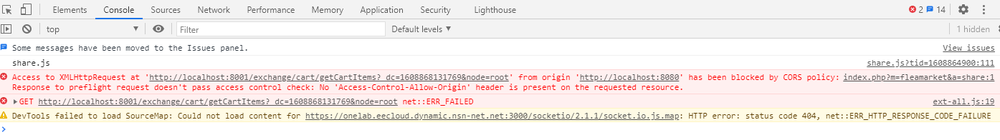
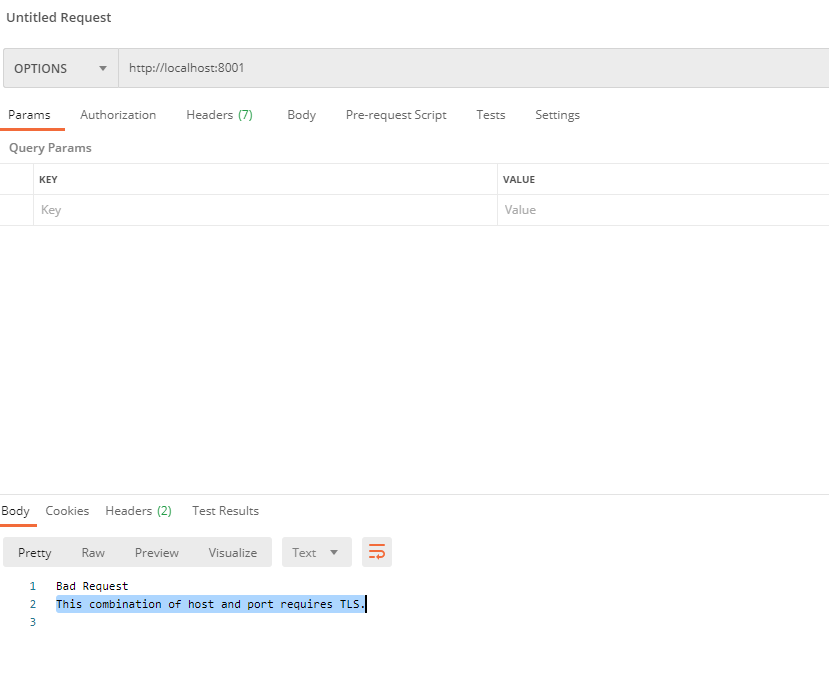

CORS 的配置在前后端分离的开发模式下非常的常见，因此也就比较熟悉了，但是今天，在各种 cors 配置没有变化的前提下，CORS  的错误又出现了（老实说，这个提示有一定的误导性，没有非常明确的指明问题的根本原因）

CORS 的配置在前后端分离的开发模式下非常的常见，因此也就比较熟悉了，但是今天，在各种 CORS 配置没有变化的前提下，CORS 的错误又出现了（老实说，这个提示有一定的误导性，没有非常明确的指明问题的根本原因）

虽然觉得 CORS 的配置不会出现问题，最近也没有做相关代码的改动，还是硬着头皮检查了一遍，又反复尝试了全局和局部的 CORS 配置，但是错误依旧

再次检查浏览器请求历史（需要使用 all选项， 只是选择 XHR  不会看到 OPTIONS 请求）

从上面的截图看，OPTIONS 返回 400，bad request ，并没有给出具体的原因，直到我手工试了 OPTIONS 请求后，才发现了问题所在，这里的错误提示就比较准确了，和 TLS 也就是 HTTPS 相关，终于想到我可能是不小心（因为最近启用了配置中心，造成了误操作）启用了 HTTPS 但是依然使用 HTTP 来请求

