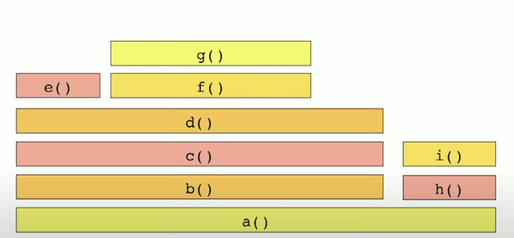
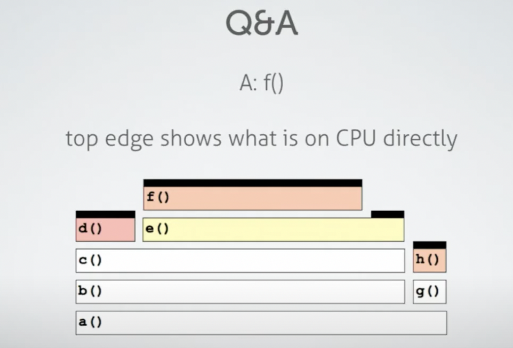
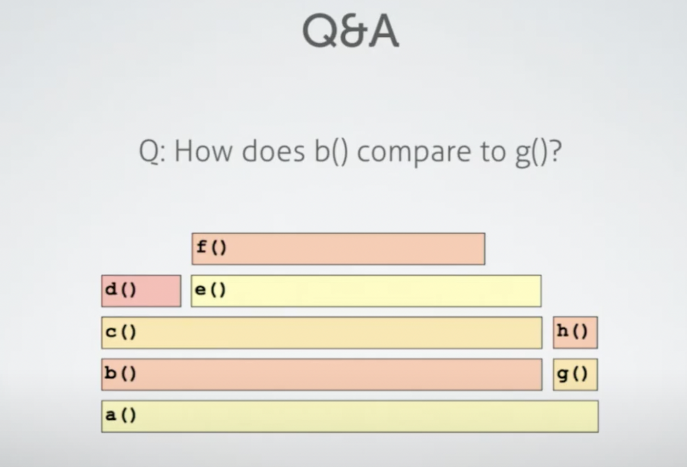

# 什么是火焰图

火焰图用来找出程序在一定使用场景下运行时的性能瓶颈。不同的使用场景会有不同的代码热点（最频繁执行的代码），因此会有不同的性能瓶颈。要获得火焰图首先要让程序跑起来，然后使用 `perf` 命令，指定程序的进程ID，`perf` 就会以一定的频率扫描进程，从而取得一系列的程序运行栈快照。把这些运行栈的快照进行合并，就是火焰图。一般优化顶端比较宽（宽意味着执行的次数多）的函数最容易取得性能上的提升。

比如在一次运行 `perf` 的时候得到如下的采样序列（`->` 代表调用）

1. `a -> b -> c ->d ->e`
2. 同 1
3. `a -> b -> c -> d -> f -> g`
4. 同3
5. 同3
6. 同3
7. `a -> b -> c ->d`
8. 同7
9. `a -> h -> i`
10. 同9


这 10 个采样经过如上图所示的合并和按字母顺序排序，就得到了火焰图


真正的火焰图


# 火焰图的含义 








# 如何获得火焰图

```
yum install perf
git  clone https://github.com/brendangregg/FlameGraph
perf record -p $PID -g -- sleep 30
perf script | FlameGraph/stackcollapse-perf.pl | FlameGraph/flamegraph.pl > process.svg
```

