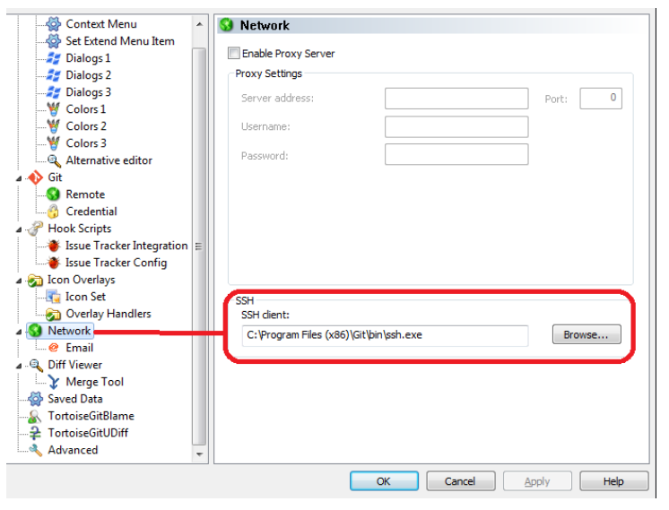

## 如何从 nacos 获取指定 namespace 下的一个配置
`http://yournacoshost:8848/nacos/v1/cs/configs?dataId=security.conf&group=DEFAULT_GROUP&tenant=yournamespace`

在找到文档之前一直尝试 `namespace=yournamespace`，这里有个概念不一致的地方，这里有叫`tenant`了

更多的 open-api 的接口在[这里](!https://nacos.io/zh-cn/docs/open-api.html)

## 在 git bash 中可以使用 ssh key 操作 git，但是 tortoise git 不行
设置 tortoise git 使用默认的 ssh.exe就没问题了


## docker pull 提示 `Unsupported docker v1 repository request`
```
docker pull xxx-docker-prod-local.artifactory-hz1.int.net.xxx.com/xxx-web:test
Trying to pull repository xxx-docker-prod-local.artifactory-hz1.int.net.xxx.com/xxx-web ...
Pulling repository xxx-docker-prod-local.artifactory-hz1.int.net.xxx.com/xxx-web
Error: Status 400 trying to pull repository onelab-web: "{\n  \"errors\" : [ {\n    \"status\" : 400,\n    \"message\" : \"Unsupported docker v1 repository request for 'xxx-docker-prod-local'\"\n  } ]\n}"
```
看似 Docker 版本的问题，其实不是，只是没有登录😂。 登录就好，`docker login xxx-docker-prod-local.artifactory-hz1.int.net.xxx.com`

## 使用 sed 替换文件中的字符串
使用 `-i` 选项： `sed -i 's/STRING_TO_REPLACE/STRING_TO_REPLACE_IT/g' filename`

## Linux 查看占用端口的进程
`lsof -i:8080`

## 在一个 flex 容器中，如何使最后一个子对象有对齐
`float: right` 是不能用的，因为 `float` 不能用在 `flex-level` 的对象上。可以这么做：
```css
.parent {
	display: flex;
}
.child {
	margin-left: auto;
	order: 2;
}
```
```html
<div class='parent'>
	<div class='child'> ignore parent</div>
	<div>another child</div>
</div>
```
[更多关于 flex 布局的内容](!https://css-tricks.com/snippets/css/a-guide-to-flexbox/)

