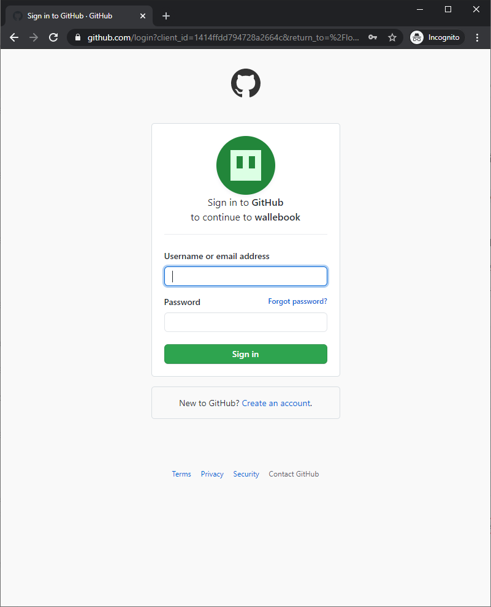
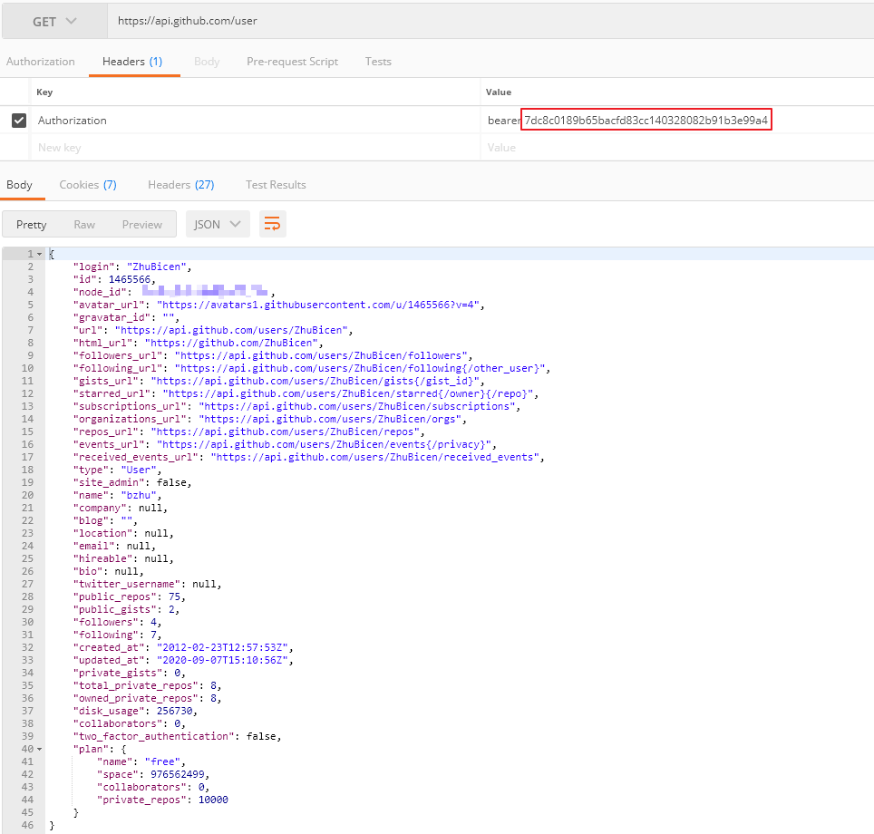

首先登录 github，依次进入 "Setting-> Developer settings -> Oauth Apps-> New OAuth App"，填写完成如下信息后，就完成了注册


然后，就可以查看到刚刚注册到的 app 的 `client id` 和 `client secret`，这就是我们用以登录 oauth2 的所有信息


接下来使用浏览器访问包含`client id` 信息的链接，请替换对应的 `client_id` (这里我们还可以指定 redirect_url，具体信息请参考文末)

`https://github.com/login/oauth/authorize?client_id=1414ffdd794728a2664c`

如果当前浏览器没有登录 github 帐号，将会重定向到如下的页面，以让用户登录 github:



登录完成后，你将会被重定向到你注册 app 时指定的 `callback URL`，我所注册的 `callback URL` 为 `http://localhost:8080`，因此被重定向到：

`http://localhost:8080/?code=377f0e139706d5b5a9e4`

使用重定向 URL 中的 code 我们就可以获取到 `access token` ，请注意我们使用的是`post` 方法，使用 `form-data` post 数据，client_secret 就是上面第二张图中的注册后的信息中可以看到


使用刚刚获取的 token 就可以获取的相应用户的信息，请注意 `header` 中的 `Authorization` 的值为 `bearer` + 一个空格 + `access_token`




另外值得注意的一点是，在第一步获取 code 的时候，还可以指定 `redirect_url`， 只是这个指定的 `redirect_url` 需要和注册 app 时指定的 `CALLBACK URL` 兼容。这里的兼容是指，URL 中的host 和 port要和注册 app 时指定的一致，目录要是注册 app 是指定的目录的子目录


比如在注册 app 是你指定的 callback URL 是： `http://example.com/path` 

```
GOOD: http://example.com/path
GOOD: http://example.com/path/subdir/other
BAD:  http://example.com/bar
BAD:  http://example.com/
BAD:  http://example.com:8080/path
BAD:  http://oauth.example.com:8080/path
BAD:  http://example.org
```


更多信息请参考：[authorizing-oauth-apps](https://docs.github.com/en/developers/apps/authorizing-oauth-apps)