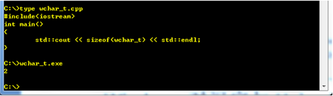
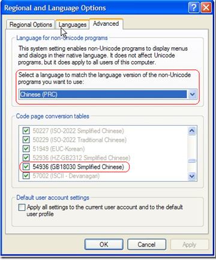
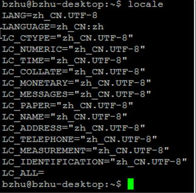

工作中时常接触到一些于编码相关的术语，比如ASCII，Unicode，UTF-8，UTF-16 ，UTF-32，在C++编程中经常会遇到char，wchar_t，std::string，std::wstring，std::cout，std::wcout，CString，TCHAR。这么多的术语到底有什么样的关系呢？本文试图理清这些概念，以及如何应用他们。

# **ASCII与汉字国标**

ASCII (American Standard Code for Information Interchange) 是美国标准信息交换码。它是一套基于拉丁字母的编码系统，主要用于显示英语和西欧语言。ASCII使用单字节进行存储，其中保留了最高位，因此可以存储128个字符，因此这种编码标准定义了33个控制字符和95个打印字符（包括空格）。

GB 2312或GB 2312-80是一个简体中文字符集的中国国家标准，全称为《信息交换用汉字编码字符集·基本集》，又称为GB0。GB2312编码通行于中国大陆。中国大陆几乎所有的中文系统和国际化的软件都支持GB 2312。GB 2312的出现，基本满足了汉字的计算机处理需要，它所收录的汉字已经覆盖中国大陆99.75%的使用频率。对于人名、古汉语等方面出现的罕用字，GB 2312不能处理，因此出现了GBK。

GBK是GB2312的一个扩展，使用了GB2312中未使用的一些代码点。微软在Win95中以Codepage936实现了GBK。后来国家相关部门又对GBK扩展形成了GBK1.0，它仅仅是GB 2312到GB 13000之间的过渡方案。

GB 13000，中华人民共和国国家标准的国家标准代码之一，全称 GB 13000.1-93《信息技术 通用多八位编码字符集（UCS）第一部分：体系结构与基本多文种平面》。此标准等同采用国际标准化组织 ISO/IEC 10646.1:1993《信息技术 通用多八位编码字符集（UCS）第一部分：体系结构与基本多文种平面》。GB 13000的字符集包含20,902个汉字。

GB 18030，全称：国家标准GB 18030-2005《信息技术 中文编码字符集》，是中华人民共和国现时最新的内码字集，是GB 18030-2000《信息技术 信息交换用汉字编码字符集 基本集的扩充》的修订版。与GB 2312-1980完全兼容，与GBK基本兼容，支持GB 13000及Unicode的全部统一汉字，共收录汉字70244个。GB 18030主要有以下特点：采用多字节编码，每个字可以由1个、2个或4个字节组成。编码空间庞大，最多可定义161万个字符。支持中国国内少数民族的文字，不需要动用造字区。

# **Unicode 编码**

通用字符集（Universal Character Set，UCS）是由[ISO](http://zh.wikipedia.org/w/index.php?title=國際標準化組織&variant=zh-tw)制定的编码方式，采用4字节编码。目前广泛应用的 Unicode 版本对应于 [UCS-2](http://zh.wikipedia.org/w/index.php?title=UCS-2&action=edit&redlink=1)，使用2字节的编码空间。UCS-2定义了字符和２字节编码的映射。这样理论上一共最多可以表示 216 即 65536个字符。基本满足各种语言的使用。实际上UCS-2尚未填满这16位的编码，保留了大量空间作为特殊使用或将来扩展。USC-2构成[基本多文种平面](http://zh.wikipedia.org/w/index.php?title=基本多文種平面&variant=zh-tw)（Basic Multilingual Plane，简称 BMP）。

一个字符的 UCS编码（Unicode 编码）是确定的。但是在实际传输过程中，由于不同[系统平台](http://zh.wikipedia.org/w/index.php?title=系统平台&variant=zh-tw)的设计不一定一致，以及出于节省空间的目的，对 Unicode 编码的实现方式有所不同。存储UCS定义编码的方式被称为Unicode转换格式（Unicode Translation Format，简称为 UTF）,UTF把字符的编码(code point)转化为字节流，根据转化方式的不同产生了UTF-8，UTF-16等。

例如，如果一个仅包含基本7位[ASCII](http://zh.wikipedia.org/w/index.php?title=ASCII&variant=zh-tw)字符的 Unicode 文件，如果每个字符都使用2字节的原 Unicode 编码传输，其第一字节的8位始终为0。这就造成了比较大的浪费。对于这种情况，可以使用 [UTF-8](http://zh.wikipedia.org/w/index.php?title=UTF-8&variant=zh-tw) 编码，这是一种变长编码，它将基本7位ASCII字符仍用7位编码表示，占用一个字节（首位补0）。而遇到与其他 Unicode 字符混合的情况，将按一定算法转换，每个字符使用1-3个字节编码，并利用首位为0或1进行识别。这样对以7位ASCII字符为主的西文文档就大大节省了编码长度（具体方案参见[UTF-8](http://zh.wikipedia.org/w/index.php?title=UTF-8&variant=zh-tw)）。

再如，如果直接使用与 Unicode 编码一致（仅限于 BMP 字符）的 [UTF-16](http://zh.wikipedia.org/w/index.php?title=UTF-16&variant=zh-tw) 编码，由于每个字符占用了两个字节，在[Macintosh](http://zh.wikipedia.org/w/index.php?title=Macintosh&variant=zh-tw) ([Mac](http://zh.wikipedia.org/w/index.php?title=Mac&variant=zh-tw))机和[PC](http://zh.wikipedia.org/w/index.php?title=PC&variant=zh-tw)机上，对字节顺序的理解是不一致的。这时同一字节流可能会被解释为不同内容，如某字符为十六进制编码4E59，按两个字节拆分为4E和59，在Mac上读取时是从低字节开始，那么在Mac OS会认为此4E59编码为594E，找到的字符为「奎」，而在Windows上从高字节开始读取，则编码为 U+4E59 的字符为「乙」。就是说在Windows下以UTF-16编码保存一个字符「乙」，在Mac OS里打开会显示成「奎」。此类情况说明UTF-16的编码顺序若不加以人为定义就可能发生混淆，于是在 UTF-16 编码实现方式中使用了[大尾序](http://zh.wikipedia.org/w/index.php?title=Big-endian&variant=zh-tw)（Big-Endian， 简写为UTF-16 BE）、[小尾序](http://zh.wikipedia.org/w/index.php?title=Little-endian&variant=zh-tw)（Little-Endian, 简写为UTF-16 LE）的概念，以及可附加的[BOM](http://zh.wikipedia.org/w/index.php?title=BOM&variant=zh-tw)（Byte Order Mark）解决方案，目前在PC机上的Windows系统和Linux系统对于UTF-16编码默认使用UTF-16 LE。（具体方案参见[UTF-16](http://zh.wikipedia.org/w/index.php?title=UTF-16&variant=zh-tw)）。

此外 Unicode 的实现方式还包括 [UTF-7](http://zh.wikipedia.org/w/index.php?title=UTF-7&variant=zh-tw)、[Punycode](http://zh.wikipedia.org/w/index.php?title=Punycode&variant=zh-tw)、[CESU-8](http://zh.wikipedia.org/w/index.php?title=CESU-8&action=edit&redlink=1)、[SCSU](http://zh.wikipedia.org/w/index.php?title=SCSU&action=edit&redlink=1)、[UTF-32](http://zh.wikipedia.org/w/index.php?title=UTF-32&variant=zh-tw)等，这些实现方式有些仅在一定的国家和地区使用，有些则属于未来的规划方式。目前通用的实现方式是 UTF-16小尾序（BOM）、UTF-16大尾序（BOM）和 UTF-8。

# **C/C++语言对Unicode的支持**

C语言中的wchar_t可以用来部分提供对Unicode的支持，但是C语言并未定义wchar_t的大小，因此wchar_t的大小是与编译器相关的。在Win32平台wchar_t是16位，可以用来存储UTF-16 code unit；在Unix平台wchar_t是32位的用来存储UTF-32 code unit。Std::out用来输出char和std::string，std::wcout用来输出wchar_t和std::wcout 。




因此如下代码在Windows下可以输出部分CJK汉字，当然此程序需要以UNICODE编译：

```

void CtestUnicodeDlgDlg::OnBnClickedOk()

{

// TODO: Add your control notification handler code here

TCHAR tch = 0x4E00;

std::wstring text ;

for( ;tch <= 0x9FC3; ++tch){

text += tch;

}

output.SetWindowTextW(text.c_str());

}
```


VC编译器会根据是否定义了UNICODE宏来决定把TCHAR翻译成char或wchar_t，更多与此相关信息请参阅Windows核心编程第２章，UNICODE

以下代码则可以输出GBK汉字：


C++0x标准将添加新的类型：std::char16_t和std::char32_t来支持Unicode，他们可以分别用来存储UTF-16和UTF-32字符串，此外可以使用’u’和’U’来定义常量字符串。
```
Std::char16_t utf16[] = u”UTF16”;

Std::char32_t utf32[] = U”UTF32”;
```
同时还有typedef std::basic_string u16string 

typedef std::basic_string u32string 

当然可以使用一些第三方库比如：i18n。

### Windows对汉字与Unicode的支持

Windows对本地编码的实现称为Code Page。比如说Windows以code page 54936实现了GB18030(code page 936实现了GBK)。Windows XP原生支持GB18030， 而Windows2000需要安装GB18030支持包，因此使用Win32API (MultiByteToWideChar和WideCharToMultiByte)可以实现GB18030和UTF-16之间的转换。

在[Windows XP](http://zh.wikipedia.org/w/index.php?title=Windows_XP&variant=zh-tw)[操作系统](http://zh.wikipedia.org/w/index.php?title=操作系统&variant=zh-tw)附带的[记事本](http://zh.wikipedia.org/w/index.php?title=记事本&variant=zh-tw)中，「另存为」[对话框](http://zh.wikipedia.org/w/index.php?title=对话框&variant=zh-tw)可以选择的四种编码方式除去非 Unicode 编码的[ANSI](http://zh.wikipedia.org/w/index.php?title=ANSI&variant=zh-tw)（对于英文系统即[ASCII](http://zh.wikipedia.org/w/index.php?title=ASCII&variant=zh-tw)编码，中文系统则为GB18030） 外，其余三种为「Unicode」（对应UTF-16 LE）、「Unicode big endian」（对应UTF-16 BE）和「UTF-8」。


非Unicode程序在其它语言的操作系统上会出现乱码，原因就是没有设置local，比如英文xp系统：



另外可以使用AppLocal同时以不同的Local运行多个程序，Windows 控制台不支持Unicode。

# **Linux对汉字与Unicode的支持**

Linux 系统通过系统local 提供对区域编码的支持，比如:zh_CN.UTF-8。Local的名字采用以下的形式：language(_territory)(.encoding)(@modifier)。Linux通过一系列的环境变量提供对多编码的支持，如果系统只需要使用一种local只需要设置环境变量LANG即可。更多信息请参考这里：http://www.linux.com/archive/feature/53781




参考：

维基百科：http://en.wikipedia.org/wiki/Main_Page

MSDN: http://msdn.microsoft.com/en-us/default.aspx

http://www.linux.com/archive/

Unicode标准化组织：http://unicode.org

Ｃ＋＋标准委员会：http://www.open-std.org/jtc1/sc22/wg21/docs/papers/