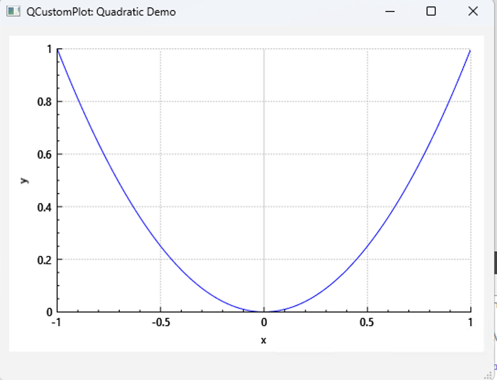
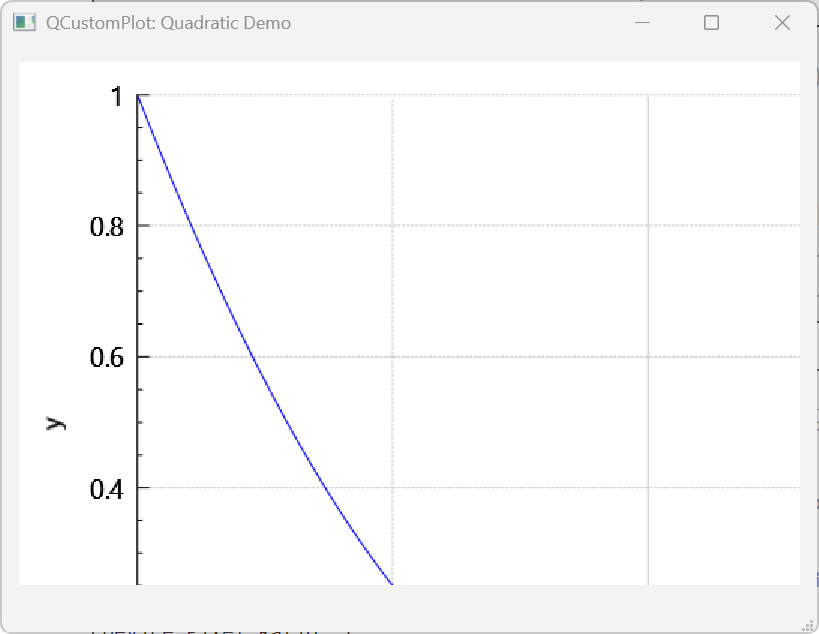
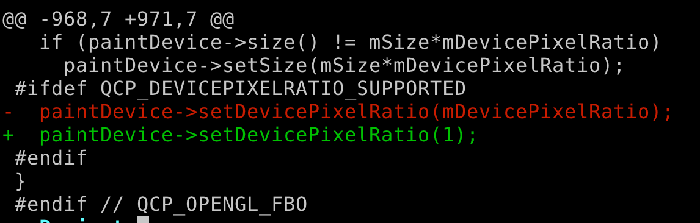
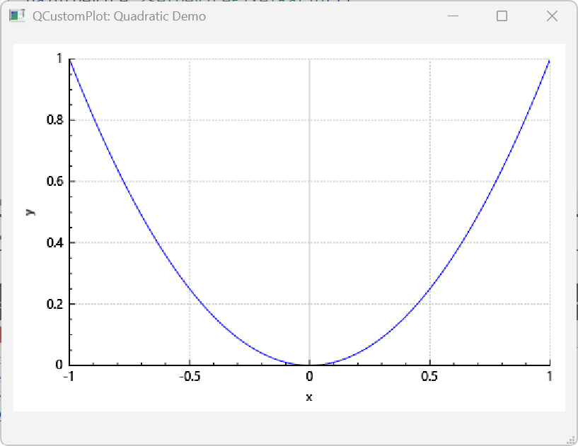

根据官方文档，openGL 是实验性的 feature, 打开 openGL 的选项后，在系统缩放不是 100% 的情况下，有图片显示不全的问题。当前的最新版本是：2.1.1。

使用自带的 example enable OpenGL 后，在 system scale 为 100% 的情况下显示为：



但是，如果缩放比率大于 100%，就会显示不全，比如 200% 的情况下：



在网上流传着一个 Fix，这个 Fix 把函数 `void QCPPaintBufferGlFbo::reallocateBuffer()` 中的 device ratio 强制改为 1：

这样改动后，确实图可以显示完全，但是它引入了另一个问题，坐标轴的数字非常模糊。实际上就是整个渲染出来图片会非常模糊，这种模糊常见于老式的应用程序没有适配 high DPI 的情况。 所以这样的 Fix 是不对的。


问题出现在`QPainter::drawImage`的使用正确的 Fix 如下：

```diff
@@ -908,7 +908,14 @@
     qDebug() << Q_FUNC_INFO << "OpenGL frame buffer object doesn't exist, reallocateBuffer was not called?";
     return;
   }
-  painter->drawImage(0, 0, mGlFrameBuffer->toImage());
+  if(QOpenGLContext::currentContext() != mGlContext.toStrongRef()){
+      mGlContext.toStrongRef()->makeCurrent(mGlContext.toStrongRef()->surface());
+  }
+  QRect targetRect(0, 0, mGlFrameBuffer->width() / mDevicePixelRatio,
+        mGlFrameBuffer->height() / mDevicePixelRatio);
+  QImage image = mGlFrameBuffer->toImage();
+  image.setDevicePixelRatio(mDevicePixelRatio);
+  painter->drawImage(targetRect, image, image.rect());
 }
```
