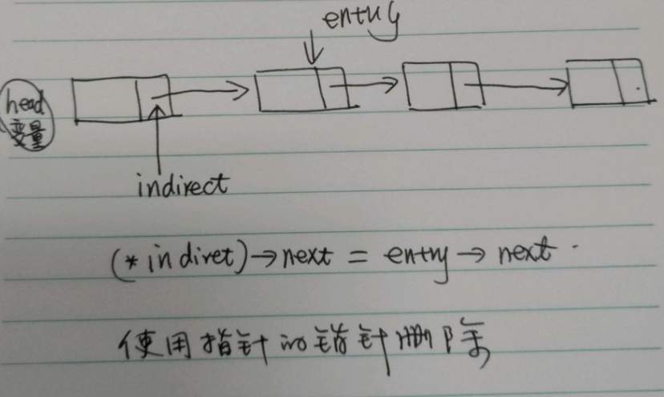

# 常规手法

使用 `walk` 变量循环指向各个链表元素，直至查询到相关节点。同时使用`prev`保留当前元素的前一个节点。在查找到相关的节点后，使用 `prev->next = entry->next`, 删除指定节点。
这里有一个特殊情况，`head` 即是要删除的指定节点，因此需要判断`prev`是否为空，来处理此情况。 Linux Torvalds 推荐的方法将去除这一特殊处理

``` c
void remove_list_entry(entry) {
  prev = NULL;
  walk = head;
 
  // walk the list to find the entry
  while (walk != entry) {
    prev = walk;
    walk = walk->next;
  }
 
  // remove the entry by updating the head or previous entry
   if (!prev) {
      head = entry->next;
   } else {
      prev->next = entry->next;
   }
}
```

## 推荐手法

`indirect` 指针指向的是 `next` 指针的地址，对于`head`节点来说，指向的是 `head`的地址。因此`indirect` 在改算法中实际上扮演的是常规算法中`prev`的角色，只不过由于`head`变量的存在，是的 `indirect`所指向的指针不可能为空，因此避免了一个多余的条件判断。

```c
void remove_list_entry(entry) {
  // The 'indirect' pointer points to the *addres* of the thing we update
  indirect = &head;
 
  // walk the list, locate the thing that points to the entry we want to remove
  while ((*indirect) != entry) {
     indirect = &(*indirect)->next;
  }
 
  // and then just remove it
  *indirect = entry->next;
}
```



## 第三种手法

增加占位（Dummy）的`head`节点，使链表不为空

```
void remove_list_entry(entry)
{
    prev = &dummy;
    while (prev->next != entry){
        prev = prev->next;
    }
    prev->next = entry->next;
    return dummy.next;
}
```