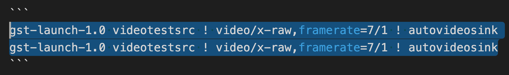

发现一怪现象
```
gst-launch-1.0 videotestsrc ! video/x-raw,framerate=7/1 ! autovideosink
gst-launch-1.0 videotestsrc ! video/x-raw,framerate=7/1 ! autovideosink
```

两个 `gst-launch-1.0` 的命令，第一个可以正常运行，第二个就是 `pipeline error` 。看起来完全一样的两个命令，直到我显示出空格，然后把屏幕放大，才发现第二个命令的 `autovideosink` 前的空白并非空格



那到底是啥，Hex 模式见真章，`C2A0` 到底是什么？

