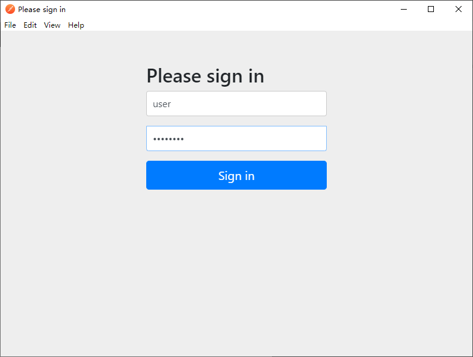

在分布式系统中，授权系统是必不可少的，作为最流行的分布式系统架构 Spring Cloud 提供了对 OAuth2 授权服务器（OAuth2 Provider）的支持。Spring 对与 OAuth2 Provider 的开发支持可以参看 [官方文档](!https://projects.spring.io/spring-security-oauth/docs/oauth2.html)。但是但是官方对与 OAuth2 Provider 的支持已经过时（Deprecated，但是仍然在发布安全更新），并独立到一个新的项目中：https://github.com/spring-projects-experimental/spring-authorization-server/，但是新的项目还在开发当中，没有正式发布。本文仍然基于老的开发方式进行讲解

Spring Cloud 对与 OAuth2 的支持都集成在 `spring.security.oatuh2` 包中，使用 Spring 开发 OAuth2 授权服务器，主要需要四个步骤：

##  1. 使用 `@EnableAuthorizationServer` 注解

该注解会启用 `/oauth/authorization` 和 `/oauth/token` 端点，用于获取授权码和 Token

```Java
@RestController
@EnableAuthorizationServer
@SpringBootApplication
public class OauthServerApplication {
    public static void main(String[] args) {
       	SpringApplication.run(OauthServerApplication.class, args);
    }
}
```

## 2. 注册 Client 信息
通过继承`AuthorizationServerConfigurerAdapter` 注册 `Client` 信息，要注册的信息包括：Client ID，Client  Secret，授权模式，重定向 URL 以及权限范围。

其中 client ID 和 Client Secret 用与 Client Authentication

```Java
@Configuration
public class Oauth2Config extends AuthorizationServerConfigurerAdapter {
    //...
    @Override
    public void configure(ClientDetailsServiceConfigurer clients) throws Exception 	   {
        clients.inMemory()
                .withClient("eagleeye")
                .secret("{noop}thisissecret")
                .authorizedGrantTypes("authorization_code")
                .redirectUris("http://localhost:9090/callback")
                .scopes("webclient", "mobileclient");
    }
    //...
}
```
## 3. 配置 Resource Owner  的信息
在配置了 Client 的信息后，需配置Resource Owner 的相关信息，也就是在 授权服务器需要输入的用户名和密码信息

```Java
    @Override
    protected void configure(AuthenticationManagerBuilder auth) throws Exception {
        auth.inMemoryAuthentication()
            .withUser("user").password("{noop}password").roles("USER")
            .and()
            .withUser("admin").password("{noop}password").roles("USER", "ADMIN");
    }
```

## 4. 提供 Rest 接口返回用户信息

在 Client 获取到 Token 之后，就可以使用该 Token 访问 `/oauth/token` 端点，获取真正的用户信息：

```Java
	@RequestMapping(value = {"/user"}, produces="application/json")
	public Map<String, Object> user(OAuth2Authentication user) {
		Map<String, Object> userInfo = new HashMap<>();
		userInfo.put(
				"user",
				user.getUserAuthentication().getPrincipal());
		userInfo.put(
				"authorities",
				AuthorityUtils.authorityListToSet(user.getUserAuthentication().getAuthorities()));
		return userInfo;
	}
```

完整的项目代码放在了 [GitHub](!https://github.com/ZhuBicen/simple_oauth2/tree/master/oauth2-server)上，下面来测试授权服务器：

## 测试 OAuth2 授权服务器

使用 Post Man 测试，创建一个 Request，在 `Authorization` 字段中选择 `OAuth 2.0`：


然后点击 `get access token` ，填入 OAuth2 相关的信息：


点击 ` Request Token`， 会跳出 `Resource Owner` 的授权信息：



输入用户名： “user”，用户名：“password”，点击 “Sign in”

就可以获取到 Access Token：


获取到 Access Token 后，就可以通过 Rest 接口获取用户的信息。点击 Use Token 按钮，请求 `/user` 就可以获取用户信息：


另外附上 OAuth2 服务器相关的资源：

1. [一个 OAuth2 授权服务器的例子：说明文档](!https://howtodoinjava.com/spring-boot2/oauth2-auth-server/Source )，代码在 [github](!https://github.com/lokeshgupta1981/SpringExamples/tree/master/oauth2)
2. [这篇文章讲述 OAuth2 的概念](!https://medium.com/@rameez.s.shaikh/spring-boot-oauth2-authorization-code-grant-beb9b3b589f3)
3. [Spring Boot 提供的 OAuth2 起步教程](!https://spring.io/guides/tutorials/spring-boot-oauth2/)
4. [OAuth2 授权码模式实现](!https://segmentfault.com/a/1190000012275317，https://www.cnblogs.com/hellxz/p/oauth2_oauthcode_pattern.html)
5. [稍微有点老的文章](!https://raymondhlee.wordpress.com/2014/12/21/implementing-oauth2-with-spring-security/)
6. [Spring  Security 和 Gateway](! https://spring.io/blog/2019/08/16/securing-services-with-spring-cloud-gateway)
7. [有详细操作步骤的一个例子](!https://developer.okta.com/blog/2019/03/12/oauth2-spring-security-guide)

