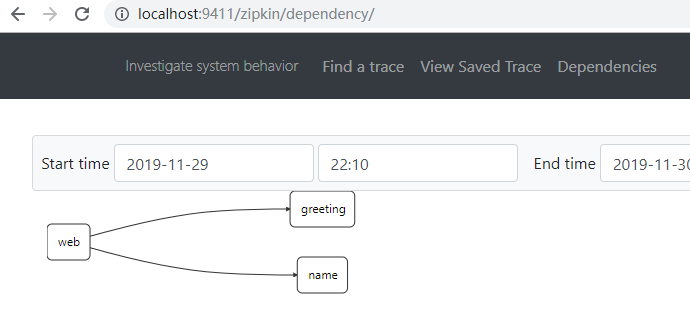

Spring Cloud 是 spring 的全家桶之一， 为使用 Java 构建微服务提供了便利的基础设施。 本文主要通过把现有的三个服务改造为微服务，以此对 Spring Cloud 微服务组件有直观的了解。

本文采用的 `Spring Cloud` 版本为：`Greenwich.SR2`， 其对应的相关组件的版本为

|  组件    |   版本   |
| ---- | ---- |
| spring-boot            |2.1.5.RELEASE|
| spring-cloud-config   |2.1.3.RELEASE|
| spring-cloud-sleuth    | 2.1.1.RELEASE |
| spring-cloud-openfeign | 2.1.2.RELEASE |
| spring-cloud-netflix   | 2.1.2.RELEASE |


介绍 Spring Cloud 的主要组件 `configserver`, `eureka`, `zipkin` 的使用。


## 准备工作

Clone 代码库：`https://github.com/ZhuBicen/spring-cloud-quickstart.git`，并了解其中的三个服务：

### Greeting 服务
Greeting  的配置文件如下：

```yml
server:
  port: 9090
greeting: Hello
```

该服务提供如下接口：
```Java
@RequestMapping("/")
public String getGreeting(){
    LOG.info("Greeting: " + greetingProperties.getGreeting());
    return greetingProperties.getGreeting();
}
```
`greetingProperties` 的作用是读取配置文件中的 `greeting` 属性 `hello`。在此限于篇幅就不再展示`GreetingProperties`的代码。

访问 `http://localhost:9090/` 会返回 `Hello`

### Name 服务
Name  的配置文件如下：

```yml
server.port: 7070
name: Bernard
```

该服务提供如下接口：
```Java
@RequestMapping("/")
public String getName() {
	LOG.info("Name: " + nameProperties.getName());
	return nameProperties.getName();
}
```
`nameProperties` 的作用是读取配置文件中的 `name` 属性 `Bernard`。在此限于篇幅就不再展示`NameProperties`的代码。

访问 `http://localhost:7070/` 会返回 `Bernard`

###  Web 服务

Web 服务， 提供 `GetMapping("/")` 接口，该接口会调用` GreetingService` 类来调用是 `localhost:9090`， 通过 `Name Servicice`调用`localhost:7070`。

`GreetingService` 的代码如下：
```Java
@Service
public class GreetingService {
	private static final String URL = "http://localhost:9090";
	private RestTemplate rest;

	public GreetingService(RestTemplate rest) {
		this.rest = rest;
	}

	public String getGreeting() {
		return rest.getForObject(URL, String.class);
	}
}
```
Web 服务使用默认的 8080 端口，访问 `localhost:8080` 会返回字符串：`Hello Bernard`。 其中 `Hello` 来自于 `:9090`, `Bernard` 来自于 `:7070`。

## 启动 Spring Cloud `configserver`,  `eureka` 以及 `zipkin`

分别在 `configserver`, `eureka` 以及 `zipkin` 下运行 `mvn spring-boot:run` 以启动三个服务

### 启动 configserver

在启动 `configserver` 前，首先适配 configserver 的 `application.yml` 中的 `searchLocations`字段，指向本地的 `config-yml` 目录。

在 `configserver` 目录下运行， `mvn spring-boot:run` 。configserver 的端口在`8888`，configserver 启动后， 可以分别访问如下的 URL，以查看 Greeting 服务，Name 服务，以及 Web 服务的 config 文件

访问 `http::localhost:8888/greeting/default` 可以查看到如下的返回：


访问 `http::localhost:8888/name/default` 可以查看到如下的返回：


访问`http://localhsot:8888/web/default`可以查看到如下的返回：


有以上可见， congfigserver 已经把我们的三个微服务的配置文件管理了起来。

### 启动 Eureka

在 `eureka` 目录下运行 `mvn spring-boot:run`

访问 `http://localhost:8761`可以查看到如下页面：


由于我们还没有向 eureka 注册任何服务，因此只看到 No instances available。后续我们将把 Greeting 服务，Name 服务以及 Web 服务向 eureka 注册


### 启动 zipkin
在 `zipkin` 目录下运行 `mvn spring-boot:run`

访问 `http://localhost:8761`可以查看到如下页面：


## 改造 Greeting， Name 以及 Web 服务

### 改造 Greeting 服务

在 pom.xml  中引入如下的四个依赖：
```xml
<dependency>
	<groupId>org.springframework.cloud</groupId>
	<artifactId>spring-cloud-starter-config</artifactId>
</dependency>
<dependency>
	<groupId>org.springframework.cloud</groupId>
	<artifactId>spring-cloud-starter-netflix-eureka-client</artifactId>
</dependency>
<dependency>
	<groupId>org.springframework.cloud</groupId>
	<artifactId>spring-cloud-starter-sleuth</artifactId>
</dependency>
<dependency>
	<groupId>org.springframework.cloud</groupId>
	<artifactId>spring-cloud-starter-zipkin</artifactId>
</dependency>
```

清空 `application.yml` 中的内容，加入以下内容：
```yml
spring:
  application:
    name: greeting
```
把 GreetingApplication.java 改为如下代码：


``` java
import brave.sampler.Sampler;
import org.springframework.boot.SpringApplication;
import org.springframework.boot.autoconfigure.SpringBootApplication;
import org.springframework.boot.context.properties.EnableConfigurationProperties;
import org.springframework.context.annotation.Bean;

@SpringBootApplication
@EnableConfigurationProperties(GreetingProperties.class)
public class GreetingApplication {

	public static void main(String[] args) {
		SpringApplication.run(GreetingApplication.class, args);
	}

	@Bean
	Sampler getSampler() {
		return Sampler.ALWAYS_SAMPLE;
	}
}
```

`spring-cloud-starter-starter-config` 会自动从 configserver `http://localhost:8888` 获取配置文件。`spring-cloud-starter-netflix-eureka-client` 会自动使用 `spring.application.name=greeting` 向服务注册中心注册。

使用 `mvn spring-boot:run` 启动 greeting 服务，可以看到如下的日志：
```
2019-11-30 20:43:31.834  INFO [greeting,,,] 46140 --- [           main] c.c.c.ConfigServicePropertySourceLocator : Fetching config from server at : http://localhost:8888
......
2019-11-30 20:43:46.005  INFO [greeting,,,] 46140 --- [nfoReplicator-0] com.netflix.discovery.DiscoveryClient    : DiscoveryClient_GREETING/DESKTOP-U63FIUL:greeting:9090 - registration status: 204

```

`Fetching config from server at : http://localhost:8888` 表明 Greeting 服务已经自动从 `configserver`获取配置文件。由于 `:8888` 是约定的默认 `configserver` 端口，所以无需配置。`DiscoveryClient_GREETING/DESKTOP-U63FIUL:greeting:9090 - registration status: 204` 该日志表明， Greeting 服务已经向 `eureka`注册成功 ， 访问 eureka 服务 `http://localhost:8761` 可以看到 Greeting 服务已经注册成功：


### 改造 Name 服务
清空 `application.yml` 中的内容，加入以下内容：
```yml
spring:
  application:
    name: name
```

把 NameApplication 同样改为如下内容：
```Java
package com.example.demo;

import brave.sampler.Sampler;
import org.springframework.boot.SpringApplication;
import org.springframework.boot.autoconfigure.SpringBootApplication;
import org.springframework.boot.context.properties.EnableConfigurationProperties;
import org.springframework.context.annotation.Bean;

@SpringBootApplication
@EnableConfigurationProperties(NameProperties.class)
public class NameApplication {

	public static void main(String[] args) {
		SpringApplication.run(NameApplication.class, args);
	}

	@Bean
	Sampler getSampler() {
		return Sampler.ALWAYS_SAMPLE;
	}
}

```

加入和 Greeting 服务相同的四个依赖，启动 Name 服务，可以看到和 Greeting 服务相似的日志内容。再次访问 `http://localhost:8761` 可以看到 Name 服务已经注册成功：


### 改造 Web 服务
清空 `application.yml` 中的内容，加入以下内容：
```yml
spring:
  application:
    name: web
```
加入同 Greeting 服务相同的四个依赖，另外加入以下两个依赖项：

```xml
<dependency>
	<groupId>org.springframework.cloud</groupId>
	<artifactId>spring-cloud-starter-netflix-zuul</artifactId>
</dependency>
```

更改 WebApplication.java 如下：
```Java
package com.example.demo;

import brave.sampler.Sampler;
import org.springframework.boot.SpringApplication;
import org.springframework.boot.autoconfigure.SpringBootApplication;
import org.springframework.boot.web.client.RestTemplateBuilder;
import org.springframework.cloud.client.loadbalancer.LoadBalanced;
import org.springframework.cloud.netflix.zuul.EnableZuulProxy;
import org.springframework.context.annotation.Bean;
import org.springframework.context.annotation.Configuration;
import org.springframework.web.client.RestTemplate;

@EnableZuulProxy
@SpringBootApplication
public class WebApplication {

	public static void main(String[] args) {
		SpringApplication.run(WebApplication.class, args);
	}

	@Configuration
	static class MyConfig {
		@LoadBalanced
		@Bean
		public RestTemplate rest() {
			return new RestTemplateBuilder().build();
		}
	}

	@Bean
	Sampler getSampler() {
		return Sampler.ALWAYS_SAMPLE;
	}
}
```
`@LoadBalance` 注解会自动拦截所有的使用 `RestTemplate`的请求，提取出其中的服务名，并使用该服务名到 eureka 中查询，相应的服务的具体信息，然后再去执行服务调用。比如我们如果使用 RestTemplate 调用 `http://greeting/`，`@LoadBalance` 会到 eureka 查询 greeting 服务对应的 IP（localhost) 和端口(9090)，再去执行真正的服务调用。

因此把原有的 GreetingService 改为如下代码：
``` Java
package com.example.demo;

import org.springframework.stereotype.Service;
import org.springframework.web.client.RestTemplate;

@Service
public class GreetingService {
	private static final String URL = "http://greeting/";
	private RestTemplate rest;
	public GreetingService(RestTemplate rest) {
		this.rest = rest;
	}
	public String getGreeting() {
		return rest.getForObject(URL, String.class);
	}
}

```

把原有的 NameService 改为如下的代码：
```Java
package com.example.demo;

import org.springframework.stereotype.Service;
import org.springframework.web.client.RestTemplate;


@Service
public class NameService {
	private static final String URL = "http://name/";
	private RestTemplate rest;
	public NameService(RestTemplate rest) {
		this.rest = rest;
	}
	public String getName() {
		return rest.getForObject(URL, String.class);
	}
}
```

经过如上的改动，Greeting 和 Name 服务对于 Web 服务已经变得透明，Web 服务只需要知道 Greeting 服务和 Name 服务的服务名称即可，不需要知道具体的服务的端口和IP。这就是服务发现的核心内容

重启 Web 服务，访问 `http://localhost:8080`，同样会返回: Hello Bernard

由于我们为 WebApplication 添加了 `@EnableZuulProxy` 注解，因此 Web 服务同时还扮演了反向代理（或者称之为”服务网关“）的角色，因此我们可以通过 Web 服务调用 Greeting 和 Name 服务。

访问 `http://localhost:8080/name/`，Zuul 会自动从 eureka 查询 name 服务的IP和端口，并发起调用。访问 `http://localhost:8080/greeting/`，Zuul 会自动从 eureka 查询 greeting 服务的IP和端口，并发起调用。


### 查看 Zipkin 服务器
访问 Zipkin `http://localhost:9411`，由于以上代码中 ` Sampler` 的配置，可以看到 zipkin 已经可以分析出，web, greeting 和 name 服务间的依赖关系



点击 ”Find Traces" 还可以看到更多的内容：


## 参考文档：
[Spring Cloud Config 官方文档]( https://cloud.spring.io/spring-cloud-static/spring-cloud-config/2.1.3.RELEASE/single/spring-cloud-config.html )
[Spring Cloud Sleuth 官方文档](https://cloud.spring.io/spring-cloud-sleuth/2.1.x/)


