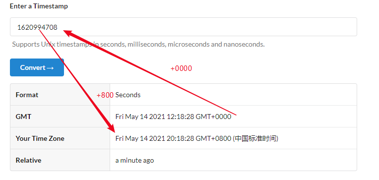

UNIX timestamp 是和时区无关的，它指的是自从 UTC 1970年1月1号开始计数经过的秒数（或者毫秒数）。

比如对于 UNIX timestamp 1620994708，它相当于：

+ GMT 时间： Fri May 14 2021 12:18:28 GMT+0000
+ 中国标准时间：Fri May 14 2021 20:18:28 GMT+0800 (中国标准时间)

最近遇到一个 bug 是这样的情况，从数据库中 Select 出一组数据，每一个记录中有一个 Datetime 字段，从着一组数据中找出日期最新的字段并把它转成 UNIX timestamp 存入数据库。数据库的时区为中国标准时间: GMT+0800。以上所说的这段逻辑是在 Java 中实现的，程序运行在 Docker 上，但是由于在把 Datetime 转化为 timestamp 的过程中使用了系统的默认时区 GMT+0000，因此在数据库中使用 `FROM UNIXTIMESTAMP()` 转化为 Datetime 时就和原本的 Datetime 多加了8小时

假定从数据库获得的时间是 2021/05/14 12:18:28 ，这时的时区是 GMT +0800，但是如果以时区 GMT+0000 去转化为 UNIX timestamp 的话，会转化为 1620994708，在使用 GMT +800 把此 UNIXTIMESTAMP 转化为 UNIX timestamp 时，就会变为 2021/05/14 20:18:28。这样就相差了 8 个小时

因此在把 Datetime 转化为 UNIX timestamp 时一定要使用正确的时区

